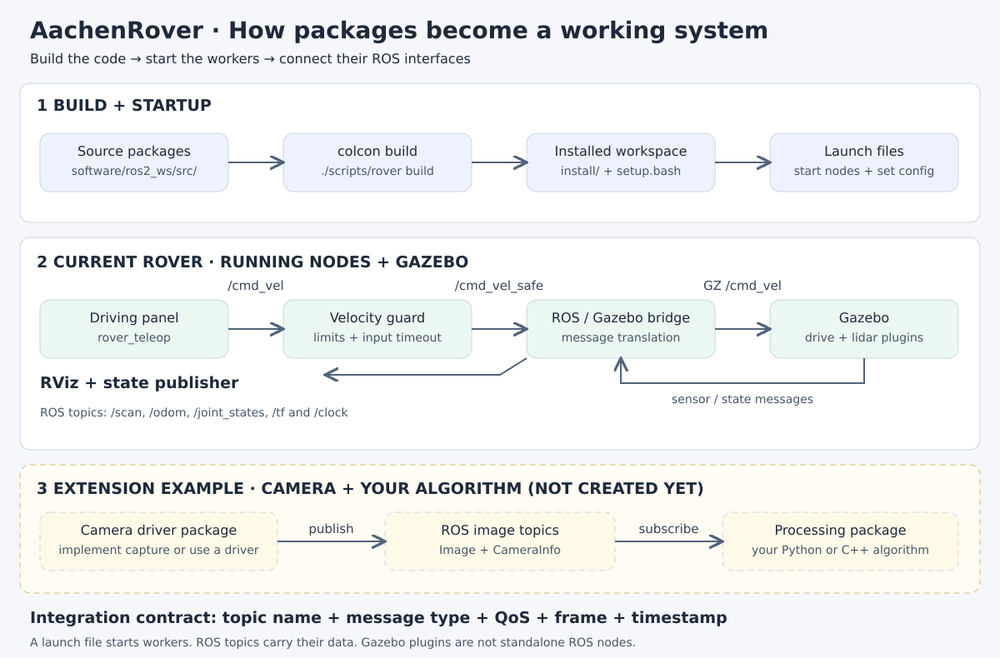

# AachenRover

A collaborative, Perseverance-inspired rover project: original mechanical CAD,
hardware integration guidance, and board-independent Linux / ROS 2 software.
The first simulation uses a simplified six-wheel skid-steer rover with a 360°
lidar in a Gazebo test yard. It does not yet model rocker-bogie suspension,
steerable corner wheels, autonomous exploration, or a validated physical build.

## Understand and extend the system

Start with the [visual package integration guide](docs/integration.md): the current
rover graph, package/node concepts, a camera pipeline, combined launch files, and
live graph debugging.



## Drive the simulation

Baseline: Ubuntu 24.04, **ROS 2 Jazzy + Gazebo Harmonic**. See
[installation and troubleshooting](docs/simulation.md) for dependencies.

```bash
./scripts/rover doctor
./scripts/rover build
./scripts/rover sim
```

To use NVIDIA GPU rendering, install the correct driver and libraries for your NVIDIA Graphics card, then run:

`./scripts/rover sim-nvidia`

To use Intel GPU rendering, run:

`./scripts/rover sim`

Gazebo, RViz, and a driving window open. Focus the driving window and hold
**WASD / arrow keys**, or hold its mouse buttons. Release to stop; Space or Esc
also stops. RViz shows `/scan`. A box and cylinder are already in the yard to
make obstacle returns visible. Closing or unfocusing the controls stops input;
a separate watchdog stops stale commands. Ctrl-C in the launch terminal exits.

```bash
./scripts/rover check
./scripts/rover test
# Server on this workstation’s display GPU (terminal 1):
ROS_DOMAIN_ID=73 GZ_PARTITION=aachen_test ./scripts/rover sim gui:=false teleop:=false rviz:=false headless_rendering:=false
# Live acceptance check (terminal 2, same domain/partition):
ROS_DOMAIN_ID=73 GZ_PARTITION=aachen_test ./scripts/rover smoke
```

## Add a camera or another worker

```bash
./scripts/rover create-package rover_camera --language python --template camera --node-name camera
./scripts/rover build
./scripts/rover launch rover_camera camera.launch.py
```

Use `--language cpp` for C++. The generator creates the source, ROS build metadata,
launch file, and configuration; implement device capture in `read_sample()`.
See [package development](docs/development.md) for generic workers and integration.

## Project areas

- [Software architecture and ROS contract](docs/architecture.md)
- [Simulation, lidar, and adding obstacles](docs/simulation.md)
- [Hardware and original CAD inventory](hardware/README.md)
- [Agent harness and provider onboarding](docs/agents.md)
- [Validation record and current limitations](docs/validation.md)

`AGENTS.md` is the shared agent entry point. Portable skills live in `skills/`,
with discovery links for Codex and Claude. Claude, Qwen, Gemini, and Copilot
have small adapter files. Other hosts, including agents using Meta/Llama or
Qwen models, can consume `./scripts/rover context`; actual tool support is a
property of the host, so universal native integration is not assumed.

New software and documentation are Apache-2.0; see [LICENSE](LICENSE).
Pre-existing CAD and the original shopping list retain their original rights;
this repository does not establish their provenance or relicense them.
