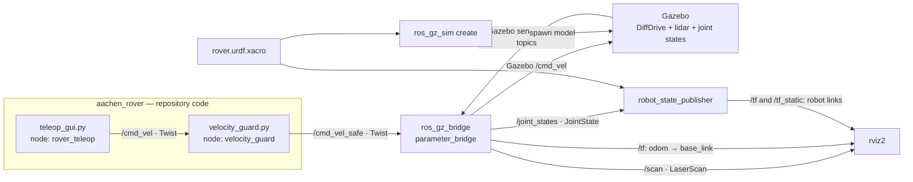
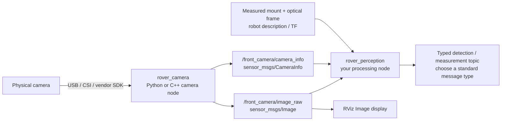
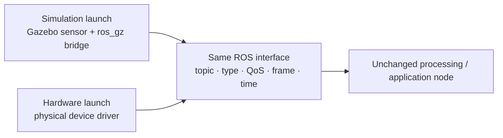

# Integrating ROS packages in AachenRover

Start here when adding a sensor, a processing algorithm, or another worker.
For commands to generate code, see [package development](development.md). For
exact topics and frame ownership, see the [interface contract](architecture.md).


## 1. The pieces you connect

| Piece | What it does | Example in this repository |
| --- | --- | --- |
| Workspace | Groups packages for building and running | `software/ros2_ws/` |
| Package | Contains code, dependencies, launch files, and configuration | `aachen_rover` |
| Node | Running worker with one responsibility | `velocity_guard` |
| Topic | Named stream of typed messages | `/scan`: `sensor_msgs/msg/LaserScan` |
| Publisher / subscriber | Produces / consumes a topic | Lidar produces scans; RViz consumes them |
| Launch file | Starts nodes or includes other launch files | `sim.launch.py` |
| Parameters | Configure a node | Camera `device`, `rate_hz`, `frame_id` |
| TF | Describes where coordinate frames are relative to each other | `odom -> base_link -> lidar_link` |
| Bridge | Translates between different middleware systems | Gazebo Transport ↔ ROS through `ros_gz_bridge` |

A package is a source/build unit; a node is a runtime unit. One package may
contain several nodes. Python and C++ nodes can exchange the same ROS messages.
Ordinary ROS-to-ROS communication does not need another bridge or direct
imports of the other node's implementation. Nodes discover peers in the same
ROS domain, subject to network/discovery configuration.

Use topics for streams, services for short request/reply operations, and actions
for longer tasks needing feedback and cancellation. Currently this rover's main
data flow uses topics. These concepts follow the official ROS 2
[nodes](https://docs.ros.org/en/jazzy/Concepts/Basic/About-Nodes.html) and
[topics](https://docs.ros.org/en/jazzy/Concepts/Basic/About-Topics.html) guides.

## 2. What actually runs today

Only `aachen_rover` is currently a repository-owned ROS package. Camera,
perception, navigation, and bringup packages below are **extension examples**, not
already-installed components. Installed ROS packages provide the bridge, spawner,
state publisher, and RViz. Gazebo plugins execute inside Gazebo; they are not
standalone ROS nodes.



The diagram omits `/clock` and `/odom` arrows for readability. The bridge publishes
both; `/clock` supplies simulation time and `/odom` supplies wheel odometry.
RViz receives the robot description from the state publisher too. Launch starts
and configures these processes; it does not carry their messages.

Change the actual system in these files:

| Task | File under `software/ros2_ws/src/aachen_rover/` |
| --- | --- |
| Start/configure simulation processes | `launch/sim.launch.py` |
| Translate a new Gazebo topic into ROS | `config/bridge.yaml` |
| Add a simulated sensor or change robot geometry | `urdf/rover.urdf.xacro` |
| Add obstacles | `worlds/mars_yard.sdf` |
| Display an additional topic | `config/rover.rviz` |
| Change driving input / limits | `scripts/teleop_gui.py` / `scripts/control.py` |

## 3. Three different kinds of integration

| Layer | What you must connect | What this does **not** do |
| --- | --- | --- |
| Build | Declare dependencies in `package.xml`; configure installation in `setup.py` or CMake | Does not start nodes or route messages |
| Startup | Include package launch files in one bringup launch | Does not make mismatched topics or message types compatible |
| Runtime | Match resolved topic names, message types, QoS, clock, and TF | Does not install missing libraries or start a driver |

Colcon discovers packages in `src` automatically. You do not add each package
to a central registry. A consumer depending only on `sensor_msgs/Image` needs
`sensor_msgs`, not an import of the camera package. A bringup package that starts
both camera and perception should declare both as runtime dependencies.

## 4. Example: physical camera → your processing node

This is a proposed extension. The existing generator supplies the camera's ROS
shell, but you must implement capture or use an existing driver.



A practical sequence:

1. **Choose the input/output contract.** For this camera, use `Image` and
   `CameraInfo`. Define acquisition timestamps, optical frame, namespace, and
   QoS. Choose an output message for processing before writing its publisher.
2. **Create the packages if they do not already exist.**

   ```bash
   ./scripts/rover create-package rover_camera --language python --template camera --node-name camera
   ./scripts/rover create-package rover_perception --language python --node-name perception --dependency sensor_msgs
   ```

3. **Implement the camera.** Edit `rover_camera/rover_camera/camera.py` under
   `software/ros2_ws/src/`. Fill `read_sample()` with capture and calibration;
   the unimplemented scaffold intentionally publishes nothing.
4. **Subscribe from your processing node.** In the generated perception file,
   add the following import, subscription in `Worker.__init__`, and callback
   method. Keep the generated `main()` and existing initialization. This example
   logs frame dimensions; it is a starting point for your algorithm.

   ```python
   from sensor_msgs.msg import Image
   from rclpy.qos import qos_profile_sensor_data

   # Inside Worker.__init__, after super().__init__(...):
   self.image_subscription = self.create_subscription(
       Image, 'image', self.on_image, qos_profile_sensor_data)

   # A method on Worker:
   def on_image(self, message):
       self.get_logger().debug(f'Frame: {message.width} x {message.height}')
       # Process or queue the image here; avoid blocking the executor.
   ```

5. **Connect the input at launch.** The processing node uses the relative name
   `image`; remap it to `/front_camera/image_raw`. This lets you change cameras
   without editing algorithm code. The bringup example below supplies this remap.
6. **Configure geometry and time.** Add the measured camera mount and optical
   frame to the physical robot description. Optical axes are x right, y down,
   z forward. Set `use_sim_time=false` for physical operation. A 3D consumer needs
   TF connectivity; a simple image viewer can show an image without that TF.
7. **Build, launch, and inspect.** Build with `./scripts/rover build`; run the
   nodes and inspect the live graph using the commands in section 7. Seeing a
   publisher is not proof of frames: confirm messages arrive after capture exists.

The camera template publishes with best-effort sensor-data QoS. The example
subscriber matches it; a reliable-only subscriber would not connect to that
best-effort publisher. Topic names alone are not a complete interface contract.

## 5. Start several packages together: a bringup launch

A bringup package groups deployment startup/configuration. Create one when you
need a single command for several workers. It is not needed to build packages.
For the camera example:

```bash
./scripts/rover create-package rover_bringup --language python --node-name bringup \
  --dependency rover_camera --dependency rover_perception
```

The generic generator also supplies a worker; this example does not use that
worker. Save the following as
`software/ros2_ws/src/rover_bringup/launch/camera_pipeline.launch.py`. The generated
Python package already installs every `launch/*.launch.py` file when rebuilt.

```python
from pathlib import Path
from ament_index_python.packages import get_package_share_directory
from launch import LaunchDescription
from launch.actions import IncludeLaunchDescription
from launch.launch_description_sources import PythonLaunchDescriptionSource
from launch_ros.actions import Node


def generate_launch_description():
    camera_share = Path(get_package_share_directory('rover_camera'))
    return LaunchDescription([
        IncludeLaunchDescription(
            PythonLaunchDescriptionSource(
                str(camera_share / 'launch/camera.launch.py')),
            launch_arguments={
                'namespace': 'front_camera',
                'use_sim_time': 'false',
            }.items()),
        Node(
            package='rover_perception', executable='perception',
            name='perception', namespace='vision', output='screen',
            parameters=[{'use_sim_time': False}],
            remappings=[('image', '/front_camera/image_raw')]),
    ])
```

Then:

```bash
./scripts/rover build
./scripts/rover launch rover_bringup camera_pipeline.launch.py
```

This starts the camera and processing workers only. It does not start Gazebo,
actuators, or a physical robot state publisher. Once capture is implemented,
running it will access the configured camera. Set the camera's configuration
before use. If your processing node needs its generated YAML, pass its config
file in `Node(parameters=[...])` as the generated launch does.

Do not expect launch-list order to mean a device or service is ready. Subscribers
can be created before publishers; code that needs a service should wait for that
service with a bounded timeout. Hardware initialization needs its own readiness
and error handling.

## 6. Reuse application code between simulation and hardware



Choose one source for a given sensor topic per deployment. The camera generator
does not create a Gazebo camera. Add that sensor to the model and bridge its
image/calibration topics if you want the camera pipeline in simulation. Set
simulation-time consumers to `use_sim_time=true` and ensure `/clock` exists.
Do not run the simulated and physical sources together under the same names.

For driving, maintain the documented velocity and odometry interfaces. Real
actuation still needs appropriate steering kinematics, controller-side timeout,
and a physical emergency stop; the simulation launch is not physical bringup.

## 7. See the live graph and debug connections

After starting your chosen launch, open another terminal in the repository root:

```bash
source /opt/ros/jazzy/setup.bash
source software/ros2_ws/install/setup.bash
# Use the same ROS_DOMAIN_ID as the launch if you selected a custom domain.
ros2 node list
ros2 topic list -t
ros2 node info /velocity_guard
ros2 topic info /scan --verbose
ros2 run rqt_graph rqt_graph
```

`rqt_graph` is installed on the current machine. It shows the **running** nodes
and topic connections, not source files or every package on disk. Adjust its
filters to show topics/leaf nodes if the graph appears incomplete. The diagrams
in this guide explain intended architecture, including explicitly labelled
future extensions; `rqt_graph` shows what actually started.

For the camera example, once created and launched:

```bash
ros2 node info /front_camera/camera
ros2 topic info /front_camera/image_raw --verbose
ros2 topic hz /front_camera/image_raw
ros2 param get /front_camera/camera use_sim_time
ros2 run tf2_ros tf2_echo base_link camera_optical_frame
```

The TF command needs the physical robot description/state publisher and the
measured mount transform; the camera scaffold alone does not supply these.
Measured topic rates also depend on the diagnostic subscriber's QoS and load.

| Symptom | Check first |
| --- | --- |
| Package/executable not found | Rebuild; source the correct install overlay; verify setup.py/CMake installation |
| Node missing from graph | Launch output, process exit, ROS_DOMAIN_ID, network discovery |
| Topic exists but no messages | Driver implemented and ready? Correct device? Publisher sending anything? |
| Publisher and subscriber do not connect | Fully resolved topic name, message type, compatible QoS |
| Images work but spatial processing fails | Optical frame, measured TF, calibration, acquisition timestamps |
| Time-dependent node stalls | `use_sim_time=true` without an active `/clock`, or paused simulation |
| Conflicting drive commands | More than one velocity source; add a mux before enabling autonomy |

For the existing simulated rover, finish integration changes with the checks
in [simulation.md](simulation.md). For a new device, add tests for the behavior
you implement and record separately what was verified with real hardware.
